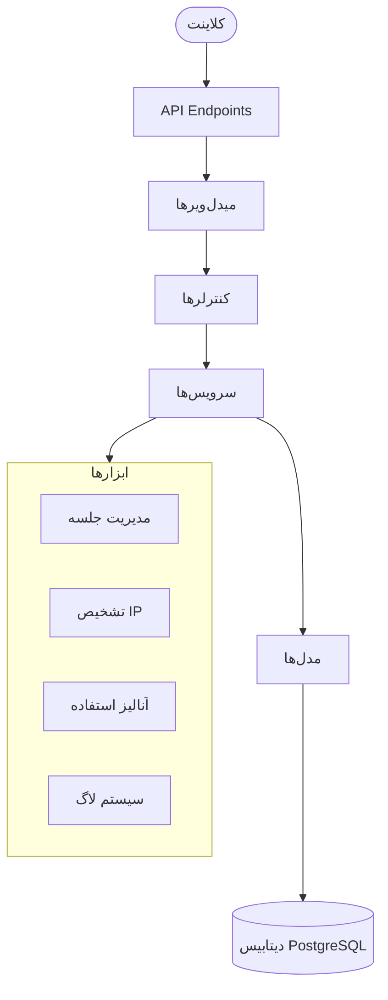
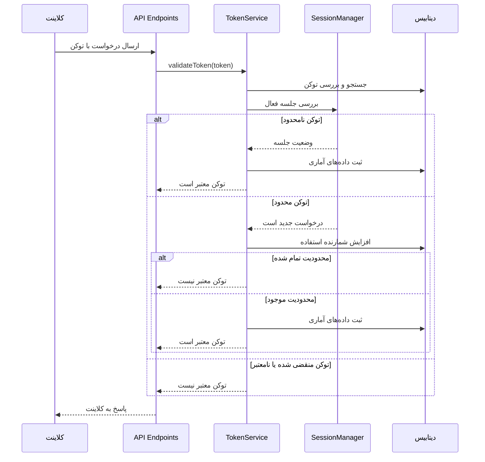

# Auth Token Hub

سامانه مدیریت توکن‌های دسترسی برای API ها و سرویس‌های مختلف

## معرفی پروژه

Auth Token Hub یک سامانه مدیریت توکن برای کنترل دسترسی کاربران به API و سرویس‌های مختلف است. این سیستم امکان ایجاد، اعتبارسنجی، به‌روزرسانی و لغو توکن‌ها را فراهم می‌کند و همچنین قابلیت محدودیت تعداد درخواست (Rate Limiting) و آمارگیری استفاده را دارد.

## ویژگی‌های کلیدی

- ایجاد توکن‌های JWT امن با تاریخ انقضا مشخص
- پشتیبانی از توکن‌های نامحدود و محدود
- سیستم هوشمند مدیریت جلسه برای محاسبه دقیق تعداد درخواست‌ها
- محدودیت‌های ماهانه و کلی برای استفاده از API
- جمع‌آوری داده‌های آماری از استفاده توکن‌ها
- رابط API کامل برای مدیریت توکن‌ها
- مستندات Swagger برای API ها
- پشتیبانی از ویژگی‌های اختصاصی برای هر توکن

## معماری سیستم



## گردش کار سیستم



## نصب و راه‌اندازی

1. مخزن را کلون کنید
2. `yarn install` را اجرا کنید
3. فایل `.env.development` را بر اساس نمونه `.env.example` ایجاد کنید
4. `yarn dev` را برای اجرای سرور در حالت توسعه اجرا کنید

## نقاط پایانی API

### 1. ایجاد توکن برای کاربر
- **روش:** `POST`
- **آدرس:** `/api/v1/create`
- **بدنه درخواست:**

  ```json
  {
    "clientId": "client123",
    "monthlyLimit": 1000,
    "durationMonths": 3,
    "isUnlimited": false,
    "isPremium": false,
    "projectType": "web"
  }
  ```

### 2. اعتبارسنجی توکن کاربر
- **روش:** `POST`
- **آدرس:** `/api/v1/validate`
- **بدنه درخواست:**

  ```json
  {
    "token": "eyJhbGciOiJIUzI1NiIsInR5cCI6IkpXVCJ9..."
  }
  ```

### 3. دریافت همه توکن‌های کاربر
- **روش:** `GET`
- **آدرس:** `/api/v1/all`

### 4. دریافت اطلاعات توکن خاص کاربر
- **روش:** `GET`
- **آدرس:** `/api/v1/{clientId}`

### 5. به‌روزرسانی توکن کاربر
- **روش:** `PUT`
- **آدرس:** `/api/v1/{clientId}`
- **بدنه درخواست:**

  ```json
  {
    "additionalRequests": 500,
    "newMonthlyLimit": 1500,
    "additionalMonths": 2,
    "isUnlimited": false,
    "isPremium": true,
    "projectType": "desktop"
  }
  ```

### 6. لغو توکن کاربر
- **روش:** `POST`
- **آدرس:** `/api/v1/{clientId}/revoke`

### 7. دریافت داده‌های آنالیز
- **روش:** `GET`
- **آدرس:** `/api/v1/analytics/{clientId}`
- **پارامترهای Query:**
  - `period`: دوره زمانی (`week`, `month`, `sixMonths`, `all`) - پیش‌فرض: `all`
  - `page`: شماره صفحه برای صفحه‌بندی - پیش‌فرض: `1`
  - `pageSize`: تعداد آیتم‌ها در هر صفحه - پیش‌فرض: `20`

## تغییرات اخیر: سیستم مدیریت جلسه

در نسخه جدید، یک سیستم مدیریت جلسه (Session Management) هوشمند پیاده‌سازی شده است که محدودیت‌های استفاده از توکن را بهینه‌تر می‌کند:

### نحوه عملکرد
- هر کاربر بر اساس توکن و IP آدرس، یک جلسه فعال دارد که برای مدت مشخصی (پیش‌فرض: 15 دقیقه) معتبر است.
- درخواست‌های متعدد در این بازه زمانی فقط یک بار شمارش می‌شود.
- این سیستم باعث می‌شود که رفرش‌های مکرر صفحه باعث کاهش زیاد تعداد درخواست‌های مجاز نشود.
- برای توکن‌های نامحدود، تمام درخواست‌ها ثبت می‌شوند اما محدودیتی اعمال نمی‌شود.
- جلسات منقضی شده به صورت دوره‌ای پاکسازی می‌شوند تا از مصرف بی‌رویه حافظه جلوگیری شود.

### مزایا
- تجربه کاربری بهتر با حفظ محدودیت‌های امنیتی
- محاسبه دقیق‌تر تعداد استفاده واقعی از سرویس
- جلوگیری از کاهش ناخواسته اعتبار کاربر در اثر رفرش‌های مکرر

## ساختار پروژه

```
auth-token-hub/
├── src/
│   ├── config/
│   │   ├── database.js
│   │   ├── environment.js
│   │   └── swagger.js
│   ├── controllers/
│   │   ├── analytics/
│   │   ├── apiAuth/
│   │   └── token/
│   ├── middleware/
│   │   ├── authMiddleware.js
│   │   ├── errorHandler.js
│   │   └── rateLimiter.js
│   ├── models/
│   │   ├── AccessToken.js
│   │   ├── ApiToken.js
│   │   ├── MakeupUsage.js
│   │   └── UsageData.js
│   ├── routes/
│   │   ├── analyticsRoutes.js
│   │   ├── apiAuthRoutes.js
│   │   └── tokenRoutes.js
│   ├── services/
│   │   ├── analyticsService.js
│   │   ├── apiTokenService.js
│   │   ├── makeupAnalyticsService.js
│   │   └── tokenService.js
│   └── utils/
│       ├── ipDetector.js
│       ├── logger.js
│       ├── sessionManager.js
│       ├── usageAnalytics.js
│       └── userAgentUtils.js
├── .env.development
├── .env.example
├── .eslintrc.js
├── CONTRIBUTING.md
├── docker-compose.yml
├── Dockerfile
├── package.json
├── README.md
└── yarn.lock
```

## توسعه و تست
- `yarn dev`: اجرای برنامه در حالت توسعه
- `yarn dev:reset`: اجرای برنامه با ریست دیتابیس
- `yarn lint`: اجرای لینتر
- `yarn test`: اجرای تست‌ها

## داکر
- `yarn docker:build`: ساخت تصویر داکر
- `yarn docker:up`: اجرای کانتینر
- `yarn docker:down`: توقف کانتینر
- `yarn docker:logs`: مشاهده لاگ‌ها

## مستندات
مستندات Swagger در آدرس `/api-docs` در دسترس است و جزئیات کامل API ها را نشان می‌دهد.